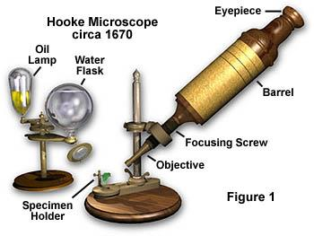
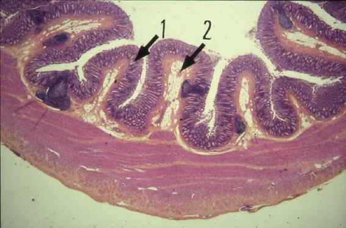
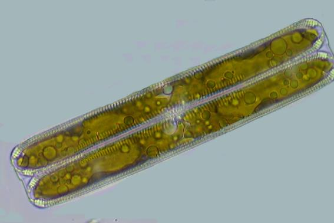
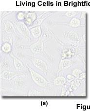
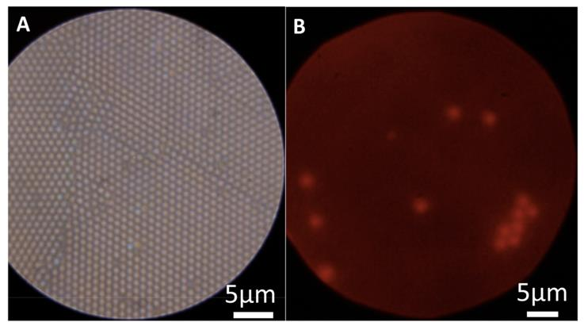
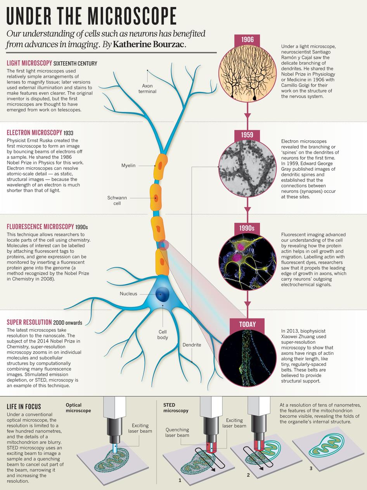
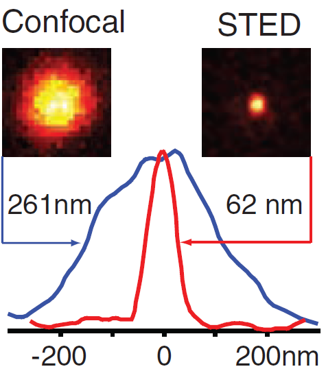
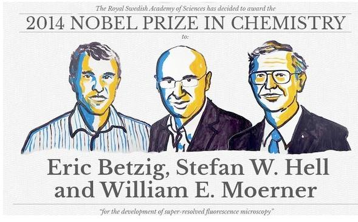

## Why Microscopy?

The cell is the fundamental unit of life, and its inner workings operate at spatial scales — nanometers to hundreds of microns — that are entirely inaccessible to the naked eye. Optical microscopy is the primary tool by which we observe living systems in real time, with molecular specificity. It sits at the intersection of physics, chemistry, and biology, and its continued development directly drives biological discovery.

## A Brief History

The compound microscope was developed in the late 16th century; the first serious scientific instruments were built in the 17th century. Robert Hooke's microscope (~1670) already had the essential architecture of objective, barrel, and eyepiece:

{fig-align="center" width="55%"}

Early biological microscopy revealed the previously invisible: intestinal villi, diatoms, microorganisms. The 20th century brought electronic detectors, laser sources, and computational image analysis, transforming microscopy from a qualitative observation tool into a quantitative measurement instrument.

{fig-align="center" width="60%"}

{fig-align="center" width="65%"}

## The Modern Microscopy System

Modern videomicroscopy integrates a research microscope with motorized stages, scientific cameras, illumination controllers, and image acquisition/analysis software into a single computer-controlled system:

{fig-align="center" width="65%"}

## The Optical Path

The compound microscope is a two-lens system: the objective forms a real magnified intermediate image; the eyepiece (or tube lens + camera) re-images this onto the detector. Understanding the conjugate planes — specimen plane, objective rear focal plane, eyepiece, camera — is essential for correct Köhler illumination and optimal image quality.

{fig-align="center" width="70%"}

{fig-align="center" width="70%"}

## Contrast Modes

Most biological specimens are essentially transparent — they produce negligible amplitude contrast in simple brightfield transmission. Several modes address this:

**Brightfield** is the baseline — amplitude contrast only, requiring staining for most specimens.

**Phase contrast** (Zernike, Nobel Prize 1953) converts phase shifts introduced by the specimen's refractive index into intensity contrast, enabling imaging of living, unstained cells.

**DIC** (Differential Interference Contrast) uses a Nomarski prism to produce a pseudo-3D relief appearance sensitive to optical path length gradients.

**Fluorescence** uses specific labeling to achieve molecular contrast — the dominant mode in modern cell biology, and the subject of this course.

{fig-align="center" width="45%"}

## Frontiers: Miniaturization and Field Microscopy

The Foldscope (Prakash lab, Stanford) illustrates how the core optical principles of microscopy can be implemented at minimal cost (~\$0.50) using printed paper optics and a single polymer microlens:

{fig-align="center" width="75%"}

{fig-align="center" width="55%"}

Lensless on-chip microscopy eliminates the objective entirely, recording holographic diffraction patterns directly on a CMOS sensor for computational reconstruction — enabling very large fields of view at low cost:

{fig-align="center" width="70%"}

## The Super-Resolution Revolution

The period 2006–2014 saw a dramatic expansion of what optical microscopy can resolve, through approaches that exploit fluorophore photophysics to circumvent the diffraction limit:

{fig-align="center" width="75%"}

**STED** (Stimulated Emission Depletion, Hell) uses a depletion laser to shrink the effective PSF. **PALM/STORM** (Betzig, Moerner) use stochastic single-molecule localization. Both achieve lateral resolutions of 20–60 nm:

{fig-align="center" width="55%"}

The 2014 Nobel Prize in Chemistry was awarded to Eric Betzig, Stefan W. Hell, and William E. Moerner for the development of super-resolved fluorescence microscopy:

{fig-align="center" width="65%"}

::: {.callout-note}
## Course overview
This course covers the full chain from photons to biological insight: fluorescence principles and fluorophore photophysics → labeling strategies → the microscope optical path → digital detection → advanced techniques (confocal, TIRF, super-resolution, FRAP, FRET, RICM) → two-photon microscopy. The unifying theme throughout is understanding what each measurement actually measures, and what its fundamental limits are.
:::
