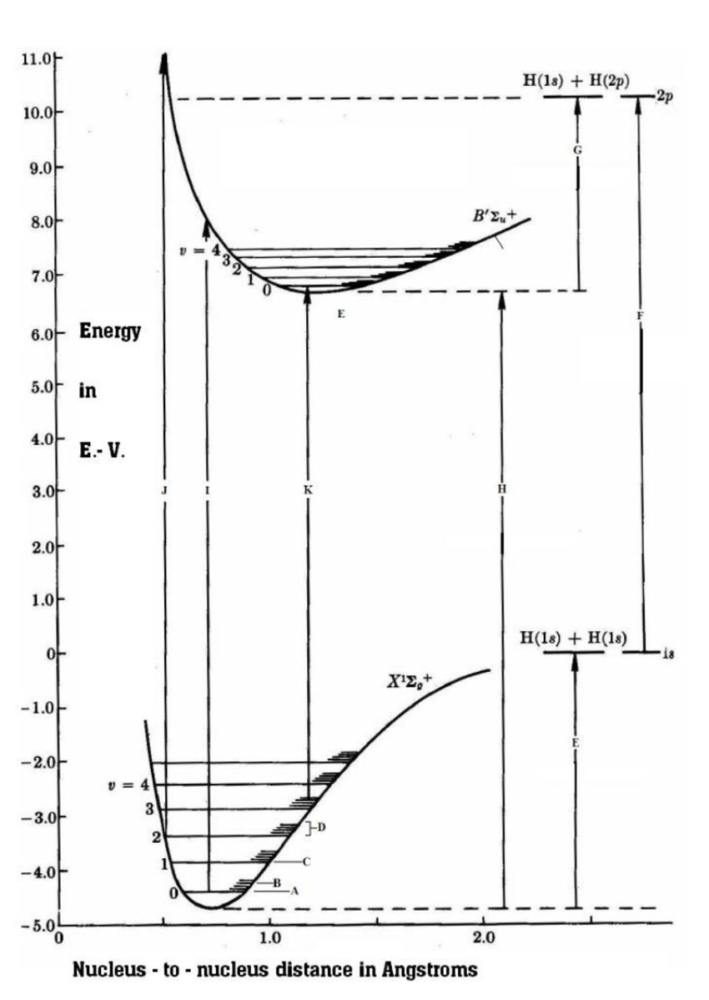
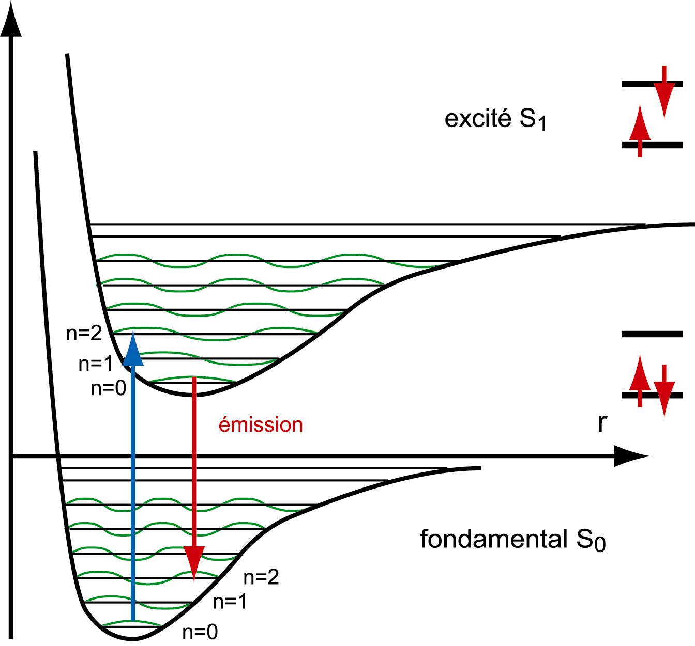
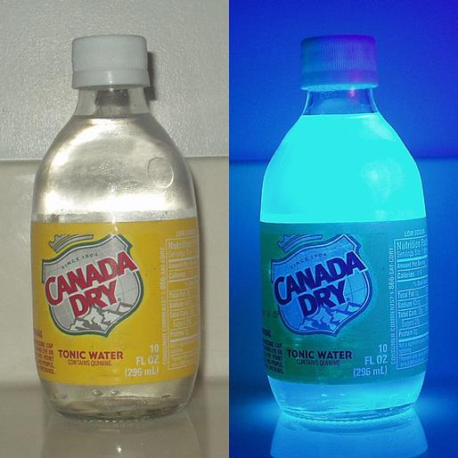
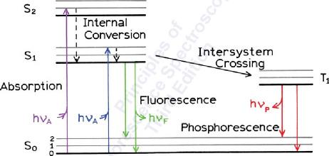
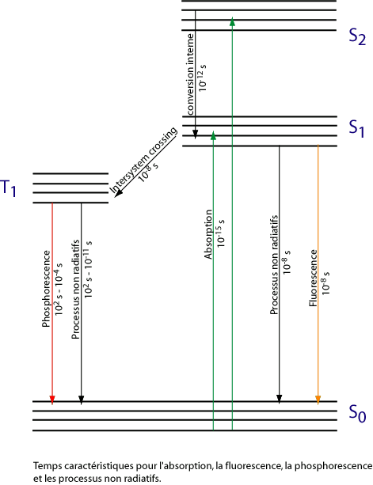
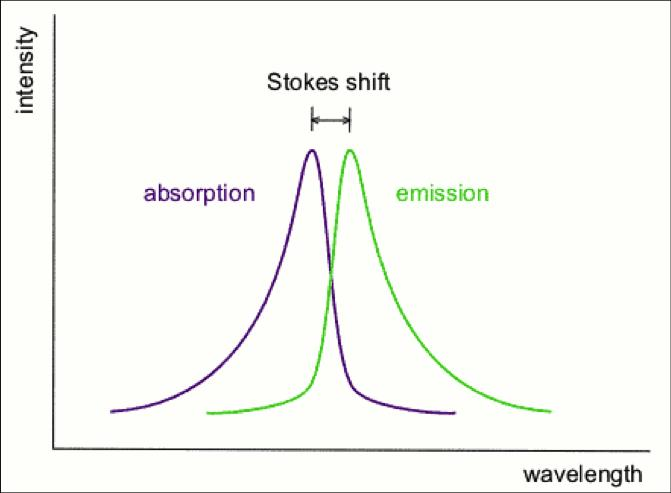
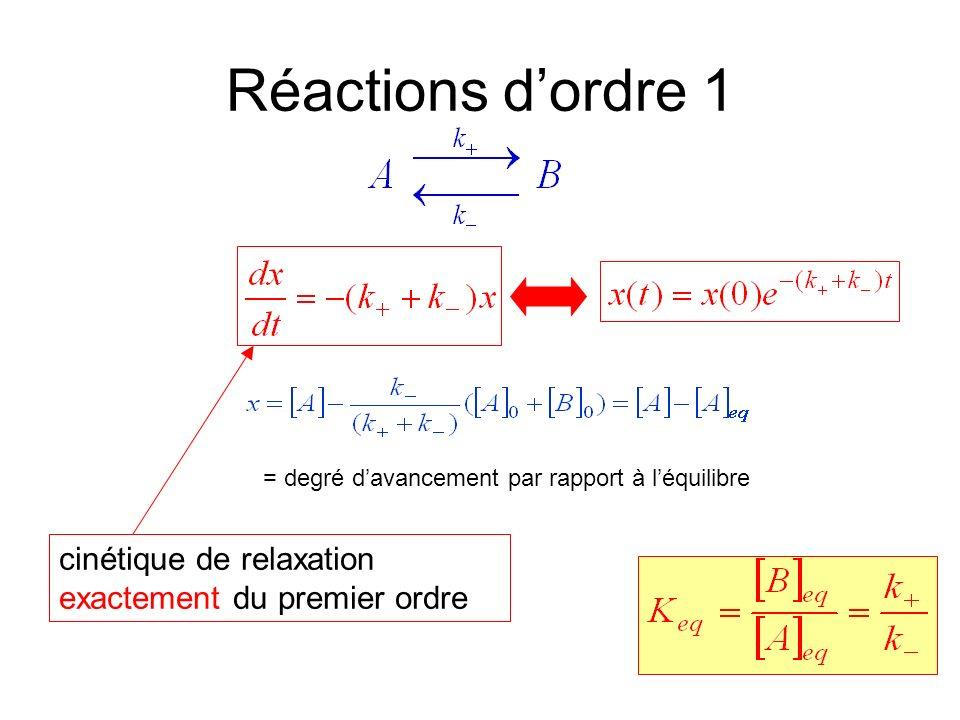
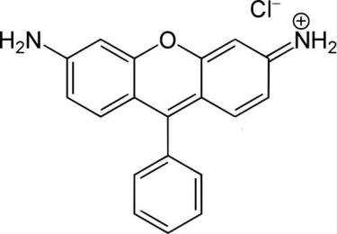

## Electronic Energy Levels

The optical properties of fluorescent molecules are rooted in their electronic structure. In polyatomic molecules, each electronic state ($S_0$, $S_1$, $S_2$, ...) is described by a potential energy surface as a function of nuclear coordinates. The ground state $S_0$ and first excited singlet $S_1$ each support a ladder of vibrational sub-levels.

{fig-align="center" width="65%"}

The Franck-Condon principle governs which vibrational transitions are favored upon absorption: electronic transitions are fast ($\sim 10^{-15}$ s) compared to nuclear motion, so the nuclear geometry is frozen during the transition. The most probable transitions are those with maximum overlap between the vibrational wavefunctions of the initial and final states.

{fig-align="center" width="70%"}

## The First Fluorophore: Quinine

Quinine, present in tonic water, is a classic example of a naturally fluorescent molecule. Under UV illumination it emits strongly in the blue, making it one of the first fluorescent substances to be systematically studied.

{fig-align="center" width="60%"}

## The Fluorescence Phenomenon

The full photophysical picture of an organic fluorophore involves several competing pathways from the excited state:

{fig-align="center" width="80%"}

The key processes and their characteristic timescales are:

- **Absorption**: $\sim 10^{-15}$ s
- **Internal conversion** ($S_2 \to S_1$, vibrational relaxation): $\sim 10^{-12}$ s  
- **Fluorescence** ($S_1 \to S_0$): $\sim 10^{-8}$ s
- **Intersystem crossing** ($S_1 \to T_1$): $\sim 10^{-8}$ s
- **Phosphorescence** ($T_1 \to S_0$): $10^{-4}$ to $10^{-2}$ s

## Molecular Spectra and Energy Quantization

The vibrational structure of both $S_0$ and $S_1$ determines the shape of the absorption and emission spectra. Each vibronic transition ($0\to n$ in absorption, $n\to 0$ in emission) contributes a band to the spectrum.

{fig-align="center" width="70%"}

## A Case Study: Anthracene

Anthracene is a canonical example because its vibrational structure is clearly resolved in both absorption and emission spectra at room temperature. The mirror symmetry between the two spectra reflects the similarity of the $S_0$ and $S_1$ potential energy surfaces.

{fig-align="center" width="85%"}

## Stokes Shift

A fundamental consequence of vibrational relaxation within $S_1$ before emission is that the fluorescence spectrum is always red-shifted relative to the absorption spectrum. This is the **Stokes shift**.

$$\Delta\nu_{\text{Stokes}} = \tilde{\nu}_{\text{abs,max}} - \tilde{\nu}_{\text{em,max}}$$

{fig-align="center" width="65%"}

The Stokes shift is critical for fluorescence microscopy: it allows the excitation light to be efficiently separated from the fluorescence signal using optical filters, since they occur at different wavelengths.

## Two-Level System Description

The kinetics of $S_1$ depopulation can be modeled as a pseudo-first-order process, treating the excited state as species $A$ and the ground state (or non-fluorescent products) as species $B$:

$$A \underset{k_-}{\overset{k_+}{\rightleftharpoons}} B$$

The excited-state population decays exponentially:

$$x(t) = x(0)\, e^{-(k_+ + k_-)t}$$

This is exactly first-order relaxation kinetics. The fluorescence lifetime $\tau$ is defined as:

$$\tau = \frac{1}{k_r + k_{nr}}$$

where $k_r$ is the radiative rate constant and $k_{nr}$ is the sum of all non-radiative rates.

{fig-align="center" width="70%"}

The simplified two-level Jablonski diagram makes explicit the competition between radiative ($\Gamma = k_r$) and non-radiative ($k_{nr}$) decay pathways from $S_1$:

{fig-align="center" width="65%"}

## Fluorophore Efficiency: Brightness

The **quantum yield** $\phi$ quantifies the fraction of absorbed photons that are re-emitted as fluorescence:

$$\phi = \frac{k_r}{k_r + k_{nr}} = \frac{\Gamma}{\Gamma + k_{nr}}$$

The **brightness** $B$ of a fluorophore combines the quantum yield with the absorption cross-section $\sigma$ (or molar extinction coefficient $\varepsilon$):

$$B = \varepsilon \cdot \phi$$

A high brightness requires both efficient light absorption ($\varepsilon$) and efficient emission ($\phi$). Rhodamine B (shown below), for example, has $\varepsilon \approx 10^5\,\mathrm{M^{-1}cm^{-1}}$ and $\phi \approx 0.7$ in ethanol, making it one of the brightest common fluorophores.

{fig-align="center" width="45%"}

::: {.callout-note}
## Key relationships
$$\tau = \frac{1}{k_r + k_{nr}} \qquad \phi = k_r \cdot \tau \qquad B = \varepsilon \cdot \phi$$

These three parameters fully characterize the photophysical performance of a fluorophore. Note that a long lifetime does not necessarily imply high quantum yield — what matters is the ratio $k_r / (k_r + k_{nr})$.
:::
