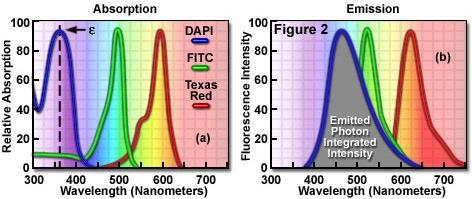
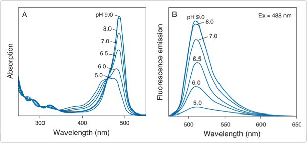
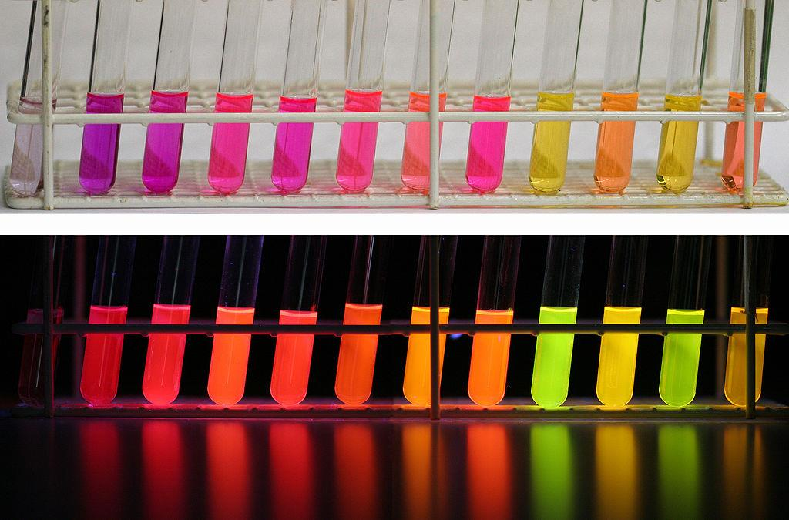
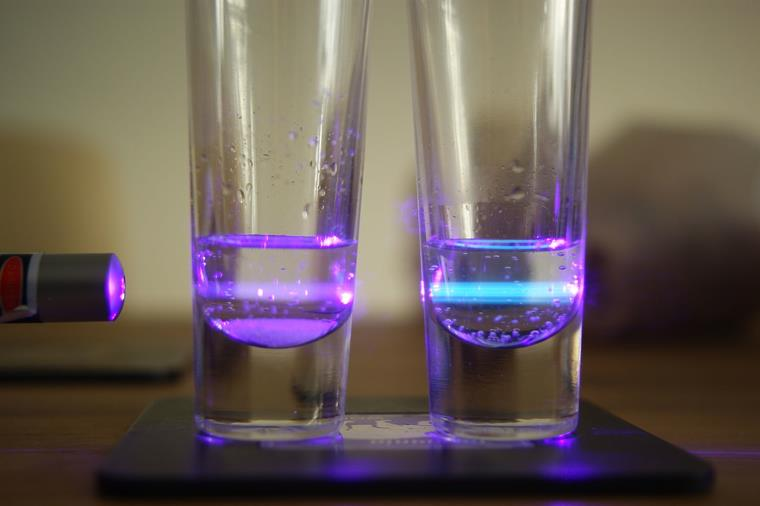
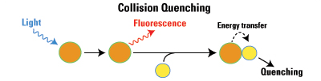
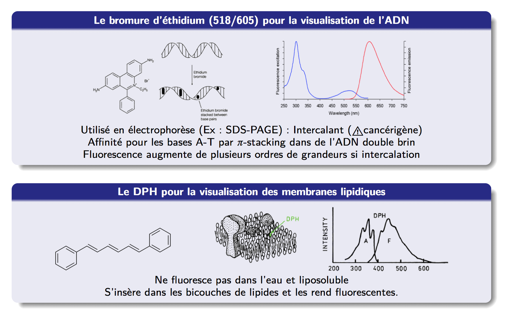
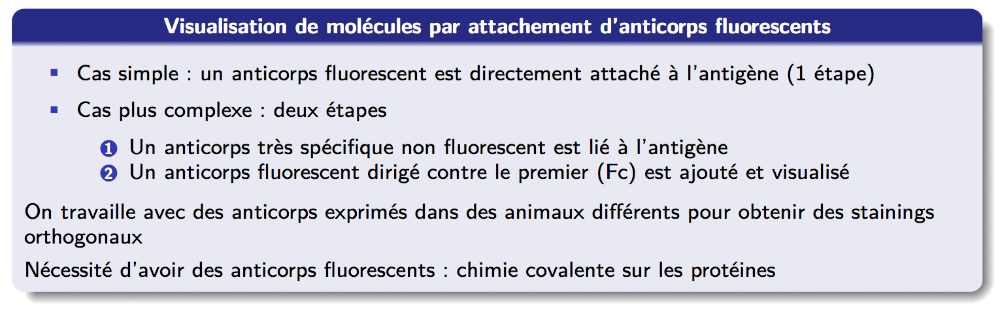
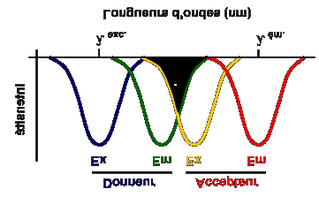
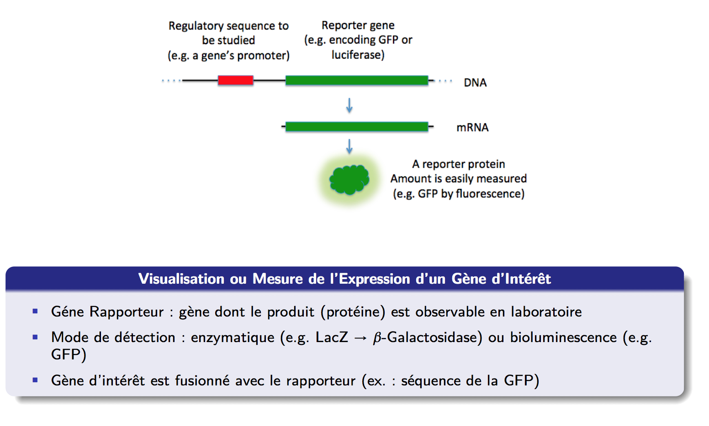

## Common Molecular Fluorophores

The choice of fluorophore determines the spectral window, brightness, photostability, and compatibility with other labels in a multicolor experiment. The figure below maps a large panel of commonly used fluorophores according to their emission wavelength and brightness ($\varepsilon \cdot \phi$), from UV-excitable probes (DAPI, Hoechst) through the visible range (fluorescein/FITC, rhodamines, BODIPY, cyanines) to near-infrared dyes (Cy5, Cy7, IRDye 700DX).

{fig-align="center" width="100%"}

Three workhorse fluorophores span most routine applications: DAPI (UV, nucleus staining), FITC/fluorescein (green, amine-reactive), and Texas Red (red, amine-reactive). Their absorption and emission spectra illustrate the spectral separation needed for multicolor imaging.

{fig-align="center" width="80%"}

## Physicochemical Environment: pH Effects

Many fluorophores are sensitive to their local physicochemical environment. Fluorescein is a canonical example: its fluorescence intensity is strongly pH-dependent because protonation of the phenolic hydroxyl disrupts the conjugated system responsible for absorption and emission.

{fig-align="center" width="75%"}

This sensitivity is exploited in biosensors and to monitor intracellular pH, but is a confound in quantitative imaging if the local pH is not controlled or known.

## A Lipophilic Fluorophore: Nile Red

Nile Red is a solvatochromic fluorophore — its emission wavelength shifts strongly with the polarity of its local environment. It is essentially non-fluorescent in water but highly fluorescent in hydrophobic environments (lipid droplets, cell membranes), making it a selective membrane and lipid probe without the need for covalent conjugation.

{fig-align="center" width="70%"}

## Collisional Quenching: Chloride Ions

Fluorescence can be quenched by dynamic (collisional) energy transfer to a quencher molecule present in solution. Cl$^-$ ions are efficient quenchers of certain fluorophores (e.g., lucigenin, SPQ) via charge-transfer interactions. The Stern-Volmer equation describes this:

$$\frac{F_0}{F} = 1 + k_q \tau_0 [Q] = 1 + K_{SV}[Q]$$

where $K_{SV}$ is the Stern-Volmer constant, $k_q$ the bimolecular quenching rate, and $\tau_0$ the unquenched lifetime.

{fig-align="center" width="60%"}

{fig-align="center" width="65%"}

## Targeting Fluorescence to Specific Structures

Most biological structures are not intrinsically fluorescent — specific labeling strategies are required. Two broad approaches exist: **non-covalent targeting** (exploiting specific affinity) and **covalent conjugation** (chemical attachment of a fluorophore to a biomolecule).

### Intercalating and Affinity Dyes

Some fluorophores report on specific molecular environments through non-covalent interactions. Ethidium bromide (EtBr) intercalates between DNA base pairs via $\pi$-stacking, with a fluorescence enhancement of several orders of magnitude upon intercalation — making it a classic DNA stain in gel electrophoresis and imaging. DPH (1,6-diphenyl-1,3,5-hexatriene) inserts into lipid bilayers and is essentially non-fluorescent in water, providing intrinsic membrane selectivity.

{fig-align="center" width="80%"}

### Immunolabeling with IgG

Antibody-based labeling is the most versatile approach for targeting fluorescence to specific proteins. An IgG antibody (MW $\approx 150\,\mathrm{kDa}$, $\sim 1500$ amino acids) consists of two heavy chains and two light chains; antigen recognition occurs at the variable Fab domains (region 1), while the Fc domain (region 2) is constant.

{fig-align="center" width="55%"}

Two immunolabeling strategies are used in practice:

**Direct labeling:** a fluorescent primary antibody binds directly to the antigen (1 step, simpler, less signal amplification).

**Indirect labeling:** a non-fluorescent primary antibody with high specificity binds first; a fluorescent secondary antibody directed against the Fc of the primary is then added. This amplifies signal (multiple secondary antibodies per primary) and allows reuse of the same fluorescent secondary across many primaries from the same host species.

{fig-align="center" width="80%"}

## Covalent Conjugation Chemistry

To produce fluorescent antibodies or other labeled biomolecules, fluorophores must be covalently attached. Two amino acid side chains are the primary conjugation targets: **lysine** (K, primary amine $-$NH$_2$) and **cysteine** (C, thiol $-$SH).

{fig-align="center" width="85%"}

The isothiocyanate reaction (FITC + $-$NH$_2$ → thiourea) is efficient at pH 8–9 and widely used for antibody labeling. Maleimide chemistry ($-$SH + maleimide → thioether) is more selective since free cysteines are rarer than lysines in most proteins, and can be exploited for site-specific labeling if a unique cysteine is engineered in.

## Labeling Stoichiometry and Self-Quenching

Increasing the number of fluorophores per protein does not linearly increase fluorescence — above a threshold, fluorophores on the same molecule undergo self-quenching via FRET between identical dyes (homo-FRET) or collisional quenching. For an IgG antibody, fluorescence is maximized at approximately 5–8 fluorophores per antibody depending on the dye.

{fig-align="center" width="75%"}

## FRET: Förster Resonance Energy Transfer

When two fluorophores are in close proximity (typically 1–10 nm) and the emission spectrum of the donor overlaps with the absorption spectrum of the acceptor, non-radiative energy transfer can occur. This is **FRET** (Förster Resonance Energy Transfer), first described by Perrin (1900) and quantified by Förster (1946).

The FRET efficiency $E$ depends on the donor-acceptor distance $r$:

$$E = \frac{1}{1 + (r/R_0)^6}$$

where $R_0$ is the Förster radius (typically 2–7 nm), defined as the distance at which $E = 50\%$.

The spectral overlap integral $J$ between donor emission and acceptor absorption is the key molecular parameter:

$$J = \int F_D(\lambda)\, \varepsilon_A(\lambda)\, \lambda^4\, d\lambda$$

{fig-align="center" width="65%"}

FRET is used as a "molecular ruler" — its $r^{-6}$ distance dependence makes it exquisitely sensitive to nanometer-scale changes in molecular conformation or complex formation.

## Photobleaching

Photobleaching is the irreversible photochemical destruction of a fluorophore upon prolonged illumination, typically via reaction of the excited triplet state with molecular oxygen to form reactive oxygen species that damage the chromophore. It is the primary limitation on the total number of photons that can be collected from a single fluorophore.

Photobleaching rates differ dramatically between fluorophore families — cyanines and BODIPY dyes are generally more photostable than fluorescein under typical imaging conditions.

{fig-align="center" width="70%"}

::: {.callout-warning}
## Photobleaching in quantitative imaging
Photobleaching introduces a systematic bias in time-lapse and multi-acquisition experiments. Always acquire the most photosensitive channel first, minimize illumination intensity, and use antifade reagents (e.g., DABCO, Vectashield, or enzymatic oxygen-scavenging systems for live imaging).
:::

## GFP: An Exception to Non-Fluorescent Life

Green Fluorescent Protein (GFP), originally isolated from the jellyfish *Aequorea victoria* by Shimomura (1962), sequenced and cloned by Prasher (1992), and expressed heterologously by Chalfie (1994), revolutionized cell biology. The 2008 Nobel Prize in Chemistry was awarded to Shimomura, Chalfie, and Tsien. GFP is a 238 amino-acid $\beta$-barrel protein whose chromophore forms autocatalytically from the tripeptide Ser65-Tyr66-Gly67.

{fig-align="center" width="80%"}

### Chromophore Formation

The GFP chromophore forms post-translationally by a spontaneous autocatalytic reaction: cyclization of the Ser65-Tyr66-Gly67 sequence, followed by oxidation by molecular O$_2$ (rate-limiting, $\tau \approx 1$ h at 37°C). No external cofactors or enzymes are required — only O$_2$.

{fig-align="center" width="85%"}

### The Fluorescent Protein Color Palette

Mutagenesis of the chromophore-forming tripeptide and surrounding residues has produced a full palette of fluorescent proteins spanning the visible spectrum. Key engineering axes include shifting emission wavelength, improving brightness, shortening maturation time, and improving photostability.

{fig-align="center" width="100%"}

### GFP as a Reporter of Gene Expression

Genetically encoding GFP downstream of a promoter of interest makes transcriptional activity directly observable by fluorescence — the gene of interest is fused to the GFP sequence, so its expression product is directly fluorescent. This approach is broadly used for:

- Tracking protein localization in real time
- Measuring promoter activity
- Following cell fate in development and immunology

{fig-align="center" width="75%"}
