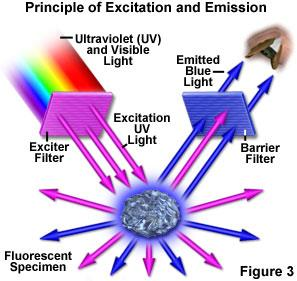
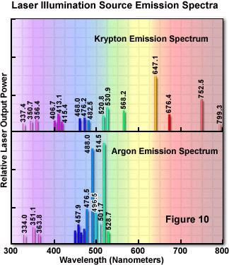

## Operating Principle of Epifluorescence

In epifluorescence microscopy, the same objective serves both to illuminate the specimen and to collect the emitted fluorescence. The excitation light and fluorescence travel in opposite directions along the same optical axis, separated by a dichroic mirror and optical filters.

{fig-align="center" width="55%"}

The three key optical elements are:

- **Excitation filter**: bandpass filter that selects the excitation wavelength from the broadband source
- **Dichroic mirror**: reflects the excitation wavelength toward the sample, transmits the (red-shifted) emission wavelength toward the detector
- **Emission filter** (barrier filter): rejects any residual excitation light, transmits only the fluorescence

{fig-align="center" width="55%"}

The efficiency of this separation depends critically on the Stokes shift of the fluorophore — a large Stokes shift allows steeper filter cut-offs and lower background.

## Widefield vs. Laser Scanning

Two fundamental illumination geometries exist in fluorescence microscopy:

{fig-align="center" width="65%"}

Widefield illumination is faster (full-frame acquisition) but collects out-of-focus fluorescence, degrading contrast in thick samples. Laser scanning trades speed for optical sectioning capability.

## Light Sources

### Mercury and Xenon Arc Lamps

The traditional light source for widefield epifluorescence is a high-pressure mercury (HBO) or xenon arc lamp. Mercury lamps have strong emission lines at 365, 405, 436, 546, and 579 nm — these happen to match common fluorophore excitation bands reasonably well, but are not tunable. Xenon lamps provide a flatter, more continuous spectrum across the visible range, better for quantitative spectroscopy.

### Monochromatic Sources: Lasers and LEDs

Modern systems increasingly use monochromatic sources:

{fig-align="center" width="65%"}

LEDs have largely replaced arc lamps in many applications — they offer fast electronic switching (no mechanical shutters needed), long lifetime, stable output, and narrow enough spectra to reduce the need for excitation filters.

## Filter Cubes and Filter Sets

A **filter cube** (or filter block) integrates the excitation filter, dichroic mirror, and emission filter into a single interchangeable unit. Most microscopes have a turret carrying 4–6 cubes, allowing rapid switching between fluorescence channels.

{fig-align="center" width="75%"}

Filter specifications are characterized by their center wavelength and bandwidth (e.g., "525/50" means centered at 525 nm with a 50 nm bandpass). Longpass emission filters (e.g., "LP515") transmit all wavelengths above the cut-on wavelength.

{fig-align="center" width="80%"}

::: {.callout-note}
## Why so many filters?
Each fluorophore requires a matched set of excitation filter, dichroic, and emission filter optimized for its specific excitation and emission peaks. Multicolor experiments require either multiple cubes (sequential acquisition) or multiband dichroics and emission filters (simultaneous acquisition, but with some spectral crosstalk trade-offs).
:::
