## From Photons to Pixels: The Detection Chain

A fluorescence microscope is a photon counting instrument. Understanding the detection chain — from photon arrival at the sensor to the final pixel value — is essential for interpreting images quantitatively and designing experiments correctly.

## CCD Cameras

A scientific CCD (charge-coupled device) camera consists of a photodiode array, thermoelectric cooling (Peltier), and readout electronics. Cooling reduces **dark current** (thermal electron generation), which is a major noise source in long exposures.

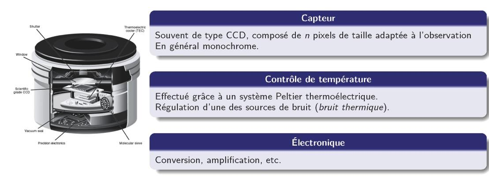{fig-align="center" width="80%"}

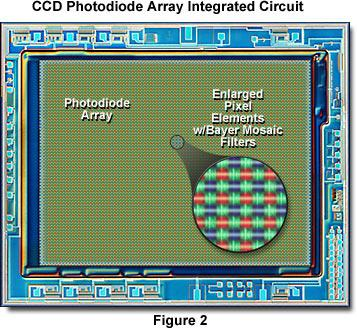{fig-align="center" width="60%"}

### Charge Transfer Principle

In a CCD, photoelectrons generated in each pixel are shifted along the sensor column by column to a single readout amplifier, using a sequence of clocked voltage gates on a p-Si substrate:

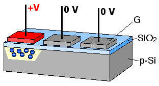{fig-align="center" width="60%"}

The key consequence: **all pixels share a single amplifier**, so read noise is added only once per frame. This gives CCDs an excellent read noise floor ($\sim 2$–$5\,e^-$ for scientific CCDs), critical for low-light fluorescence imaging.

## sCMOS Cameras

Scientific CMOS (complementary metal-oxide-semiconductor) sensors have largely replaced CCDs in modern fluorescence microscopy. Each pixel has its own amplifier, enabling parallel readout of all pixels simultaneously:

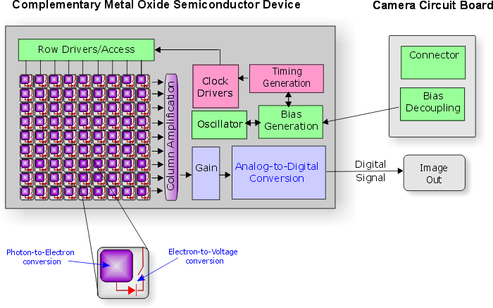{fig-align="center" width="70%"}

## CCD vs. sCMOS

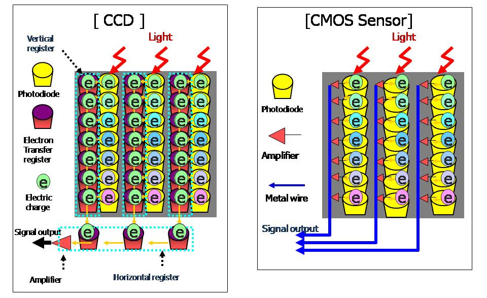{fig-align="center" width="75%"}

The key trade-offs:

| | CCD | sCMOS |
|---|---|---|
| Read noise | $\sim 2$–$5\,e^-$ | $\sim 1$–$2\,e^-$ |
| Frame rate | Moderate | Very high |
| Field of view | Moderate | Large |
| Dynamic range | High | High |
| Cost | Higher | Decreasing |

sCMOS cameras now offer superior performance for most applications, with per-pixel noise maps allowing correction of pixel-to-pixel amplifier variation.

## Digital Image: Bit Depth and Dynamic Range

The analog signal from the amplifier is digitized by an ADC (analog-to-digital converter). The **bit depth** determines how many gray levels are available:

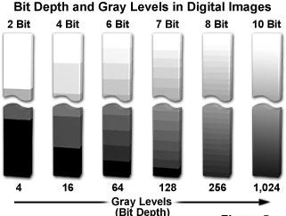{fig-align="center" width="65%"}

**Dynamic range** is the ratio of the maximum signal (full-well capacity) to the minimum detectable signal (noise floor). For quantitative imaging, you need sufficient bit depth to sample this range without losing information at either end.

## Noise Sources

The total noise in a fluorescence image has three main contributions:

**Photon shot noise** ($\sigma_{\text{shot}} = \sqrt{N}$): fundamental, follows Poisson statistics. Unavoidable — it arises from the quantum nature of light. Signal-to-noise ratio scales as $\sqrt{N}$, so collecting more photons always helps.

**Read noise** ($\sigma_{\text{read}}$): added by the amplifier during readout. Fixed per pixel per frame — reduced by cooling and by sCMOS architecture.

**Dark current** ($i_d$): thermally generated electrons accumulated during exposure. Proportional to exposure time; dramatically reduced by Peltier cooling ($\sim 2\times$ reduction per 7°C decrease in temperature).

The total noise in quadrature:
$$\sigma_{\text{total}}^2 = N_{\text{signal}} + N_{\text{background}} + \sigma_{\text{read}}^2 + i_d \cdot t$$

## Objectives and Numerical Aperture

The objective is the most critical optical element in the microscope. Its **numerical aperture** (NA) determines both light collection efficiency and lateral resolution:

$$\mathrm{NA} = n \sin\mu$$

where $n$ is the refractive index of the immersion medium and $\mu$ is the half-angle of the acceptance cone.

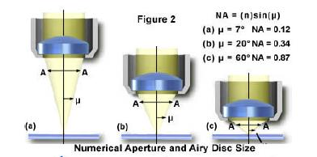{fig-align="center" width="65%"}

Light collection scales as $\mathrm{NA}^2$, so going from NA 0.5 to NA 1.4 gives nearly $8\times$ more photons per pixel — a massive practical advantage.

## Resolution: The Airy Disc and Rayleigh Criterion

A point source imaged through a circular aperture produces an **Airy diffraction pattern** — a bright central disc surrounded by concentric rings. Two point sources are considered resolved (Rayleigh criterion) when the central maximum of one coincides with the first minimum of the other:

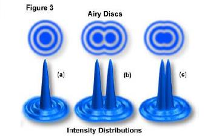{fig-align="center" width="65%"}

The lateral resolution (Rayleigh criterion) is:

$$R_{xy} = \frac{1.22\,\lambda}{2\,\mathrm{NA}} = \frac{0.61\,\lambda}{\mathrm{NA}}$$

For a typical oil-immersion objective (NA = 1.4) at $\lambda = 500\,\mathrm{nm}$:
$$R_{xy} \approx \frac{0.61 \times 500\,\mathrm{nm}}{1.4} \approx 218\,\mathrm{nm}$$

The Airy intensity pattern is formally:
$$I(P) = I_{\max}\left[\frac{J_1(ka\sin\theta)}{ka\sin\theta}\right]^2$$

where $J_1$ is the first-order Bessel function, $k = 2\pi/\lambda$, and $a$ is the aperture radius.

## Reading an Objective

All key specifications are encoded on the objective barrel:

{fig-align="center" width="55%"}

**Aberration correction classes** (in increasing order of correction):
- **Achromat**: corrected for chromatic aberration at 2 wavelengths
- **Plan**: flat-field correction (no field curvature)
- **Apochromat (Apo)**: corrected at 3–4 wavelengths, highest chromatic correction
- **Plan Apo**: both flat-field and full chromatic correction — the gold standard for fluorescence

## Aberrations

### Chromatic Aberration

Different wavelengths focus at different axial positions due to the wavelength dependence of the refractive index. This causes color fringing and z-offset between channels in multicolor imaging.

{fig-align="center" width="65%"}

### Coma

Coma affects off-axis point sources, which appear comet-shaped due to the different contributions of lens zones at different radial distances from the optical axis.

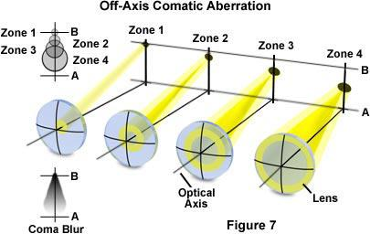{fig-align="center" width="70%"}

### Astigmatism

Astigmatism arises when the lens focuses rays in the sagittal and tangential planes at different axial positions. Between the two focal planes lies a "circle of least confusion."

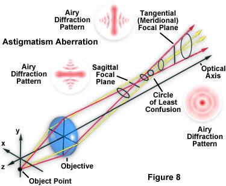{fig-align="center" width="65%"}

### Field Curvature

A flat specimen is imaged onto a curved (Petzval) surface, so the center and edges of the field cannot be simultaneously in focus with a simple lens. "Plan" objectives correct this.

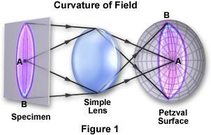{fig-align="center" width="60%"}

::: {.callout-note}
## Practical implications for quantitative imaging
Chromatic aberration causes channel-dependent z-offsets — critical to correct for colocalization analyses. Field curvature means intensity is not uniform across the field — always flat-field correct before quantitative measurements. Both are dramatically reduced in Plan Apo objectives.
:::

::: {.callout-tip}
## Resources for this chapter

**Textbooks**

- Pawley, J. (ed.) *Handbook of Biological Confocal Microscopy*, 3rd ed. Springer (2006) — Chapters 2–4: detectors, noise, and dynamic range.
- Russ, J. *The Image Processing Handbook*, 7th ed. CRC Press (2016) — comprehensive reference on digital image processing for microscopy.

**Key papers**

- Huang et al. *Video-rate nanoscopy using sCMOS camera-specific single-molecule localization algorithms*. Nature Methods (2013). [DOI](https://doi.org/10.1038/nmeth.2488) — quantitative comparison of sCMOS vs. EMCCD for single-molecule imaging.
- Waters, J.C. *Accuracy and precision in quantitative fluorescence microscopy*. J. Cell Biol. (2009). [DOI](https://doi.org/10.1083/jcb.200903097) — noise sources, dynamic range, and quantification pitfalls.
- North, A.J. *Seeing is believing? A beginners' guide to practical pitfalls in image acquisition*. J. Cell Biol. (2006). [DOI](https://doi.org/10.1083/jcb.200507103) — essential practical guide to avoiding common imaging errors.

**Online**

- [MicroscopyU — CCD Cameras](https://www.microscopyu.com/digital-imaging/introduction-to-charge-coupled-devices) — illustrated guide to CCD and sCMOS architecture.
- [Hamamatsu Learning Center](https://www.hamamatsu.com/us/en/expertise/imaging.html) — technical notes on camera selection, noise, and dynamic range.
- [iBiology — Quantitative Imaging](https://www.ibiology.org/techniques/quantitative-imaging/) — video lectures on digital image acquisition and analysis.

**Tools**

- [Fiji / ImageJ](https://fiji.sc) — open-source image analysis. Key plugins: Bio-Formats (file import), MTrackJ (tracking), Coloc2 (colocalization).
- [CellProfiler](https://cellprofiler.org) — automated image analysis pipelines for high-content screening.

**Exercises**

- Download a sample fluorescence image stack from the [Cell Image Library](http://www.cellimagelibrary.org) and measure: mean background, read noise (from dark frames), and signal-to-noise ratio for a labeled structure of interest.
:::
