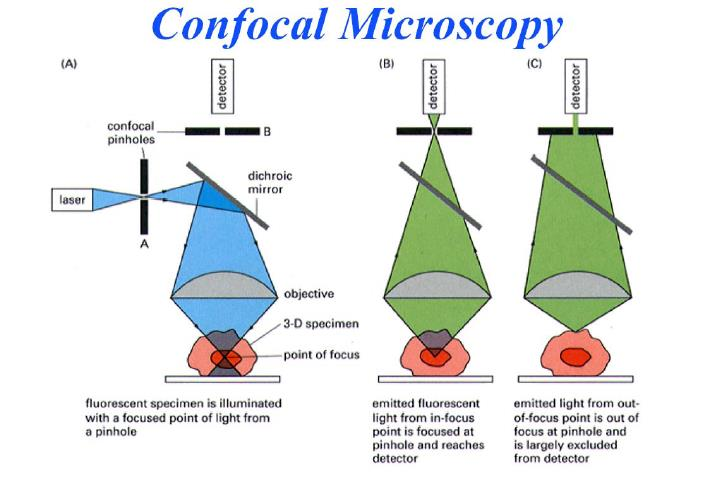
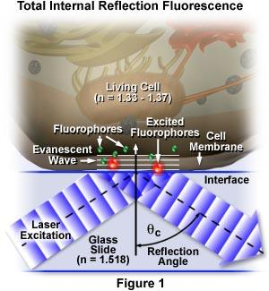
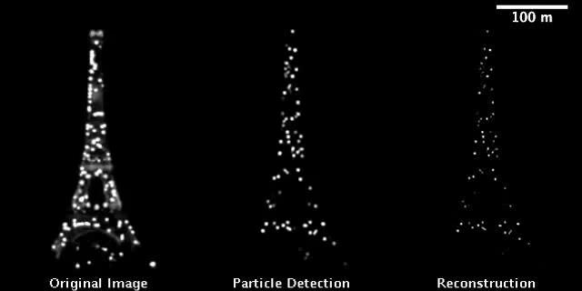
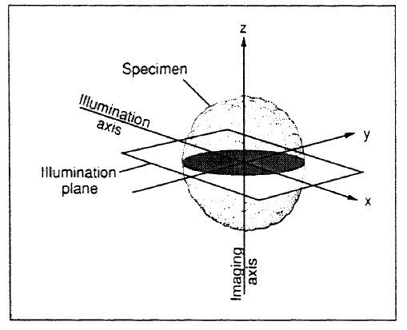
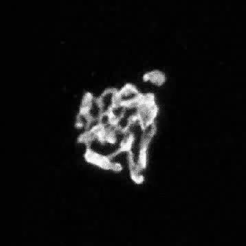

## Limits of Epifluorescence

Standard widefield epifluorescence illuminates the entire sample volume — including out-of-focus planes. In thick specimens ($> 5\,\mu$m), this generates strong background fluorescence that degrades contrast and signal-to-noise. Three strategies address this: **confocal microscopy** (optical sectioning by spatial filtering), **TIRF microscopy** (evanescent field illumination confined to $\sim 100$ nm), and **light-sheet microscopy** (orthogonal illumination).

## Confocal Microscopy

### Principle

Confocal microscopy achieves optical sectioning by placing a pinhole at the image plane conjugate to the focal point. Out-of-focus fluorescence, which would otherwise reach the detector in widefield, is geometrically rejected by this pinhole:

{fig-align="center" width="75%"}

{fig-align="center" width="55%"}

The key consequences of confocal detection:

- **Optical sectioning**: $z$-resolution $\approx 500$–$800$ nm (vs. no $z$-selectivity in widefield)
- **Improved contrast** in thick specimens
- **3D reconstruction** by $z$-stack acquisition
- **Slower** than widefield — point-by-point scanning requires $\sim 1$–$30$ s per frame

### FLIM: Fluorescence Lifetime Imaging Microscopy

Confocal systems can measure not only fluorescence intensity but also the **fluorescence lifetime** $\tau$ at each pixel. Since $\tau$ is sensitive to the local molecular environment (viscosity, pH, FRET, protein-protein interactions) independently of fluorophore concentration, FLIM provides information inaccessible from intensity images alone.

![FLIM decay curves: (a) fluorescence lifetime measurements as a function of quencher concentration (Cl$^-$), showing the shortening of $\tau$ with increasing [Q]. (b) Equivalent data showing the concentration-dependent decay. The lifetime is extracted by fitting the exponential decay $I(t) = I_0 e^{-t/\tau}$ at each pixel.](../images/p099_00.png){fig-align="center" width="75%"}

## Evanescent Wave Microscopy (TIRF)

### Snell-Descartes Law and the Critical Angle

When light travels from a dense medium ($n_1$, e.g. glass, $n = 1.518$) to a less dense medium ($n_2$, e.g. water, $n = 1.33$), beyond the critical angle $\theta_c$ defined by:

$$\sin\theta_c = \frac{n_2}{n_1}$$

total internal reflection (TIR) occurs. Rather than propagating into medium 2, the electromagnetic field decays exponentially as an **evanescent wave** with a characteristic penetration depth:

$$d = \frac{\lambda}{4\pi\sqrt{n_1^2\sin^2\theta - n_2^2}}$$

For typical parameters ($\lambda = 488$ nm, $\theta = 68°$), $d \approx 100$–$200$ nm — confining excitation to a thin layer at the glass-water interface.

### TIRF in Practice: High-NA Objectives

Objective-based TIRF uses a high-NA oil-immersion objective (NA $> 1.38$) to launch the laser at angles beyond $\theta_c$:

{fig-align="center" width="55%"}

{fig-align="center" width="65%"}

### Image Quality

The contrast improvement over widefield is dramatic:

{fig-align="center" width="65%"}

### Application: Measuring Ligand-Receptor Binding Kinetics

TIRF is ideally suited to measure interactions at the membrane. The following example illustrates the use of TIRF to measure the binding kinetics between fluorescent liposomes carrying the glycosphingolipid Le$^x$ and a supported lipid bilayer (SLB) presenting the cognate receptor:

{fig-align="center" width="85%"}

## Super-Resolution Microscopy

### Breaking the Diffraction Limit

The Rayleigh criterion ($d \approx 200$–$300$ nm for visible light) is a fundamental limit for conventional microscopy. Super-resolution methods circumvent it not by improving optics, but by exploiting the **photophysics of individual fluorophores** to separate their emission temporally.

### Localization-Based Super-Resolution (STORM/PALM)

The key idea: if only a sparse subset of fluorophores are emitting at any one time, each can be localized with precision far better than the diffraction limit by fitting a Gaussian to its point spread function:

$$\sigma_{\text{loc}} \approx \frac{\sigma_{\text{PSF}}}{\sqrt{N}}$$

where $N$ is the number of detected photons. With $N \approx 1000$ photons, localization precision of $\sim 10$–$20$ nm is achievable.

{fig-align="center" width="75%"}

The reconstruction process is analogous to determining positions from a blurred ensemble image:

{fig-align="center" width="70%"}

### Example 1: Microtubules

{fig-align="center" width="80%"}

### Example 2: Nuclear Pore Proteins

{fig-align="center" width="80%"}

## SPIM: Single Plane Illumination Microscopy

SPIM (also called light-sheet microscopy) illuminates the sample with a thin sheet of light oriented perpendicular to the detection axis, exciting fluorescence only in the focal plane of the objective.

{fig-align="center" width="55%"}

Key advantages: very low photobleaching and phototoxicity (only the imaged plane is illuminated), fast 3D imaging (no scanning needed), and suitability for large transparent specimens (embryos, organoids).

## FRAP: Fluorescence Recovery After Photobleaching

FRAP measures the lateral diffusion coefficient $D$ of membrane or cytosolic components. A focused high-power laser pulse irreversibly bleaches fluorophores in a small region of interest. Fluorescence recovers as unbleached molecules from the surrounding area diffuse in.

{fig-align="center" width="55%"}

For a circular bleach spot of radius $r$, the diffusion coefficient is:

$$D = \frac{r^2}{4 t_{1/2}}$$

where $t_{1/2}$ is the half-time of fluorescence recovery.

{fig-align="center" width="45%"}

## FRET in Practice

Recall from the fluorophores lecture that FRET efficiency depends on $r^{-6}$. In a biological context, FRET serves as a **nanometer-scale proximity sensor**: FRET occurs only when donor and acceptor are within $\sim R_0 \approx 5$–$10$ nm.

The complete FRET framework — spectral overlap, distance dependence, and dipole orientation:

{fig-align="center" width="70%"}

### Biological Application: Mechanosensing with FRET

FRET biosensors are increasingly used to report on intracellular forces. In the example below, an integrin-based tension sensor uses a TFP-Venus FRET pair connected by an elastic linker. When force is applied, the linker extends, increasing the TFP-Venus distance and reducing FRET efficiency:

{fig-align="center" width="85%"}
