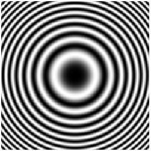
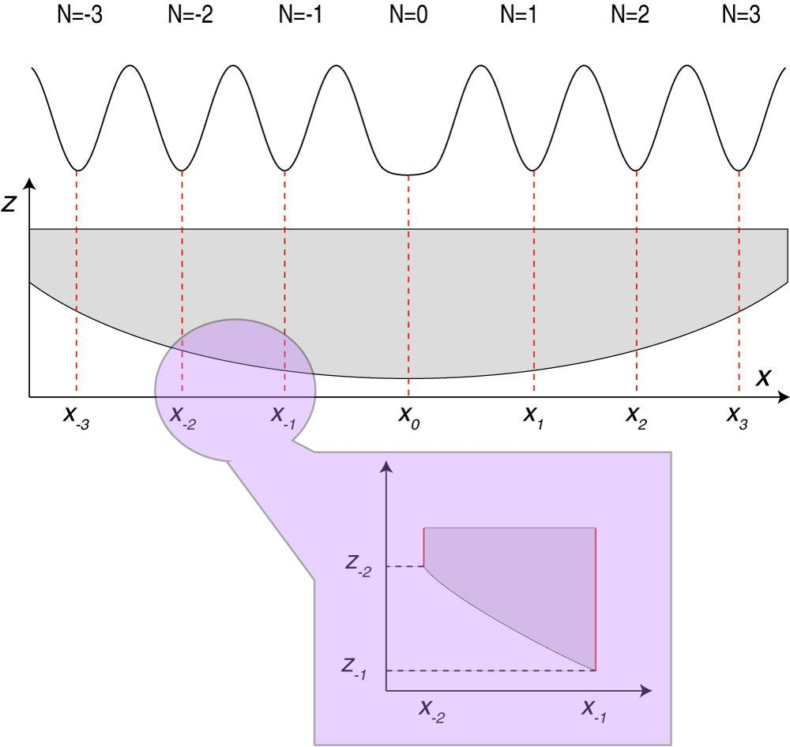
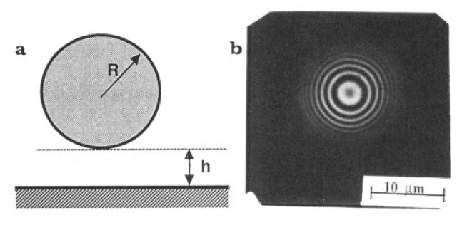
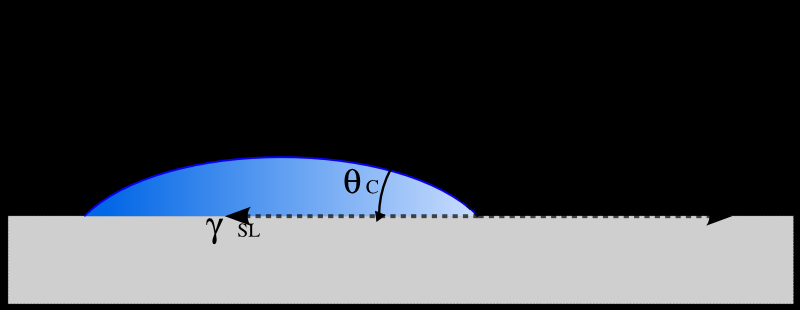
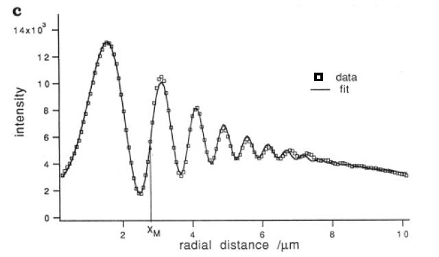
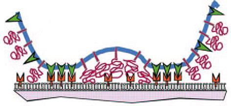
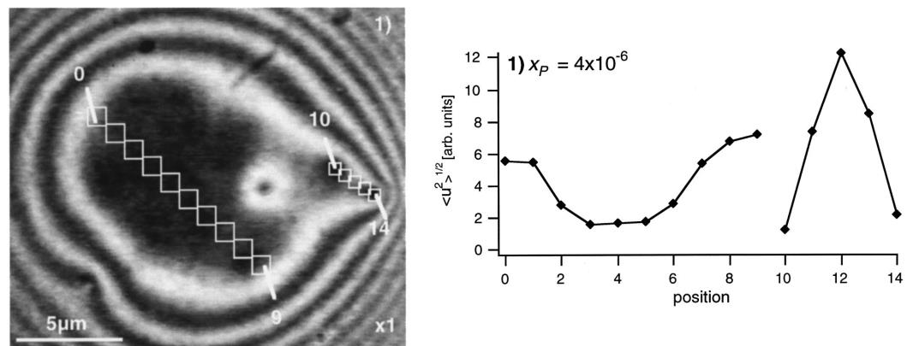

## Principle

RICM (Reflection Interference Contrast Microscopy) is a label-free technique that images the distance $h(x)$ between a particle or cell membrane and a flat glass substrate, with nanometer axial sensitivity. It exploits the interference between light reflected at the glass-water interface (beam $I_0$) and light reflected at the bottom surface of the object (beam $I_1$, $I_2$):

{fig-align="center" width="55%"}

The reflected intensity varies as:

$$I(x) \propto I_0 + I_1 - 2\sqrt{I_0 I_1}\cos\left(\frac{4\pi n\, h(x)}{\lambda} + \phi_0\right)$$

where $n$ is the refractive index of the medium, $\lambda$ the illumination wavelength, and $\phi_0$ an offset phase that depends on the Fresnel reflection coefficients. Bright fringes correspond to constructive interference, dark fringes to destructive interference.

## Newton's Rings: The Ideal Case

For a perfect sphere of radius $R$ resting at height $h_0$ above the substrate, $h(x) = h_0 + x^2/2R$, giving concentric circular fringes — **Newton's rings**:

{fig-align="center" width="45%"}

## Reading the Fringes

The fringe pattern maps $h(x)$ through the phase of the cosine. Between two consecutive fringes (dark-to-dark or bright-to-bright), $h$ increases by $\lambda/2n \approx 180$–$200$ nm for green light in water. Lateral resolution is limited by the Rayleigh criterion ($\sim 200$–$300$ nm), setting the minimum resolvable $\Delta x$.

{fig-align="center" width="70%"}

## Microscope Setup

RICM uses reflected-light illumination with a monochromatic source (interference filter on an HBO lamp) and a standard reflected-light microscope with an antiflex objective (with crossed polarizers to suppress specular reflections from the lens surfaces):

{fig-align="center" width="55%"}

## Glass Bead on Glass: A Reference Experiment

A glass bead ($n \approx 1.52$) sedimenting on a glass coverslip in water generates a clean Newton's ring pattern that can be quantitatively modeled:

{fig-align="center" width="65%"}

## Effect of Numerical Aperture

A key experimental limitation of RICM is that increasing NA increases the range of illumination angles, which averages out the fringe contrast. Higher-order fringes (large $h$) are more sensitive to this averaging than the central fringes. This sets a practical upper limit on the measurable $h$ — typically $\sim 500$–$1000$ nm for standard antiflex objectives.

## Wetting and Contact Angles

RICM can directly image the contact line and contact angle of droplets or vesicles on surfaces, giving access to solid-liquid-air surface energies:

{fig-align="center" width="70%"}

## Absolute Height Measurement: The Dual Wavelength Solution

Single-wavelength RICM measures $h$ modulo $\lambda/2n$ — i.e., fringe order ambiguity prevents absolute height determination beyond the first fringe. The dual-wavelength solution uses two illumination wavelengths $\lambda_\alpha$ and $\lambda_\beta$ simultaneously; the beat period $\Lambda = \lambda_\alpha\lambda_\beta / |2n(\lambda_\alpha - \lambda_\beta)|$ is much larger, extending the unambiguous range to several micrometers.

{fig-align="center" width="70%"}

## Colloidal Interactions: Measuring the Interaction Potential

For a colloidal particle near a surface, the equilibrium height distribution $P(h)$ is related to the interaction potential $V(h)$ via Boltzmann:

$$P(h) \propto \exp\left(-\frac{V(h)}{k_BT}\right)$$

RICM measures the instantaneous $h(x,t)$ from the fringe pattern; recording many frames gives $P(h)$ and hence $V(h)$ with $k_BT$ resolution.

{fig-align="center" width="50%"}

{fig-align="center" width="60%"}

## Cell Adhesion

RICM was originally developed to study cell adhesion. It directly images the contact zone between a cell and the substrate, without fluorescent labels. Close contact regions appear dark (small $h$, destructive interference for appropriate parameters); non-adherent regions appear bright.

### Modeling Cell Adhesion

The classic Bell-Evans-Dembo model describes cell adhesion as a competition between specific receptor-ligand bonds in the contact zone and repulsive interactions (glycocalyx, membrane tension) at the periphery:

{fig-align="center" width="60%"}

### Liposomes on Glass

Tense liposomes on glass provide a model system with well-defined mechanics. Their RICM image shows a flat central contact zone surrounded by fringes from the curved membrane:

{fig-align="center" width="75%"}

### Ligand-Receptor Interactions

Functionalizing the substrate and the liposome/cell membrane with complementary ligand-receptor pairs allows direct quantification of specific adhesion energies:

{fig-align="center" width="65%"}

### Using Membrane Fluctuations

For weakly adhered membranes, thermal fluctuations modulate $h(x,t)$. The amplitude of fluctuations $\langle u^2\rangle^{1/2}$ is suppressed in the contact zone (bonds restrict membrane motion) and recovers outside it — providing a spatially resolved map of bond density:

{fig-align="center" width="75%"}

::: {.callout-note}
## RICM in practice
RICM requires no fluorescent labels and gives nanometer-scale axial information in real time. Its main limitations are: 

(1) fringe order ambiguity (resolved by dual-wavelength or simulation); 

(2) sensitivity to refractive index inhomogeneities in the sample; 

(3) restricted to objects close to the substrate ($h < 1$–$2\,\mu$m for reliable fringe counting). 

It is most powerful when combined with fluorescence for multi-modal imaging.
:::
