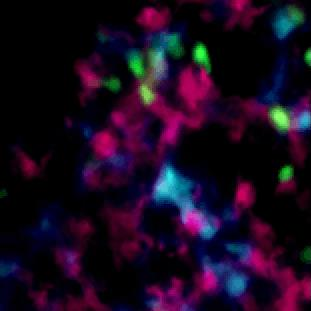

## Principle: Nonlinear Excitation

Two-photon excitation (2PE) is a nonlinear optical process in which a fluorophore absorbs two photons simultaneously, each carrying half the energy required for the $S_0 \to S_1$ transition. The probability of two-photon absorption scales as the **square** of the instantaneous intensity:

$$F_{2PE} \propto \sigma_2 \cdot I^2(t)$$

where $\sigma_2$ is the two-photon absorption cross-section (measured in Göppert-Mayer units, $1\,\mathrm{GM} = 10^{-50}\,\mathrm{cm^4\,s\,photon^{-1}}$) and $I$ is the instantaneous photon flux. This quadratic dependence is the fundamental origin of the technique's most important properties.

To achieve measurable two-photon absorption rates without damaging the sample, it is essential to concentrate the excitation in both space (tight focusing) and time (ultrashort pulses). 

A mode-locked Ti:sapphire laser delivers pulses of $\sim $ 100–150 fs duration at ~80 MHz repetition rate — concentrating photons into brief bursts while maintaining a modest average power ($<100$ mW at the sample):

{fig-align="center" width="60%"}

## Intrinsic Optical Sectioning

Because 2PE scales as $I^2$, excitation is confined to the focal volume where the intensity is highest. Out-of-focus planes contribute negligibly — even though light passes through them. This gives **intrinsic optical sectioning without a pinhole**.

The consequence is dramatically visible: in a cuvette of fluorescent dye, one-photon excitation (visible laser) illuminates the entire beam path, while two-photon excitation (near-IR, $\sim 900$ nm) produces fluorescence only at the focus:

{fig-align="center" width="60%"}

## Why Near-Infrared?

Two-photon excitation uses wavelengths roughly twice those used for one-photon excitation — typically 700–1000 nm (near-IR). This has three major practical consequences:

**Reduced scattering**: biological tissue scatters light with a wavelength dependence of approximately $\lambda^{-4}$ (Rayleigh) to $\lambda^{-1}$ (Mie). Near-IR light penetrates far deeper than visible light — enabling imaging hundreds of microns into tissue, compared to $<$50 µm for confocal.

**Reduced phototoxicity**: near-IR photons are not absorbed by most endogenous chromophores (hemoglobin, flavins, NADH), reducing out-of-focus photodamage.

**No pinhole needed**: all collected fluorescence comes from the focal volume, so non-descanned detection with large-area photomultipliers maximizes signal collection even after scattering.

## Imaging Deep into Tissue

The combination of near-IR excitation and intrinsic sectioning makes two-photon microscopy the method of choice for imaging intact tissue, *in vivo* preparations, and thick specimens where confocal fails:

{fig-align="center" width="75%"}

{fig-align="center" width="45%"}

## Instrument Configuration

Two-photon microscopy uses a laser-scanning architecture similar to confocal, but with key differences: no pinhole, non-descanned detection preferred, and a Ti:sapphire (or fiber) pulsed laser source. Fast mechanical shutters control laser exposure and protect live samples:

{fig-align="center" width="65%"}

A complete laser-scanning confocal/two-photon system integrates the scan head, microscope body, laser sources, and acquisition computers into a controlled workstation:

{fig-align="center" width="65%"}

## Two-Photon vs. Confocal: When to Choose

| | Confocal | Two-photon |
|---|---|---|
| Excitation wavelength | Visible (405–647 nm) | Near-IR (700–1000 nm) |
| Depth penetration | $< 100\,\mu$m in tissue | $> 500\,\mu$m in tissue |
| Sectioning mechanism | Pinhole | $I^2$ nonlinearity |
| Out-of-focus bleaching | Yes | Minimal |
| Phototoxicity | Moderate | Low (out-of-focus) |
| Signal at depth | Drops quickly | Much more robust |
| Cost | Lower | Higher (Ti:Sa laser) |

Two-photon excitation is the method of choice whenever depth penetration, reduced phototoxicity, or intrinsic third-harmonic generation (THG) for label-free structural imaging are needed. Confocal is generally preferable for thin specimens and multicolor experiments where near-IR two-photon cross-sections are limiting.

::: {.callout-note}
## Relation to SHG and THG imaging
Two-photon setups naturally enable **second harmonic generation** (SHG) and **third harmonic generation** (THG) imaging of non-centrosymmetric structures (collagen fibers, myosin filaments, lipid droplet interfaces) — entirely label-free. These coherent nonlinear signals appear at exactly $\lambda/2$ or $\lambda/3$ and are spectrally separable from two-photon fluorescence.
:::

::: {.callout-tip}
## Resources for this chapter

**Textbooks**

- Pawley, J. (ed.) *Handbook of Biological Confocal Microscopy*, 3rd ed. Springer (2006) — Chapter 28: two-photon microscopy; Chapter 38: nonlinear microscopy.
- Masters & So (eds.) *Handbook of Biomedical Nonlinear Optical Microscopy*. Oxford University Press (2008) — comprehensive reference on 2PE, SHG, THG, and CARS microscopy.

**Key papers — Foundations**

- Denk, Strickler & Webb. *Two-photon laser scanning fluorescence microscopy*. Science (1990). [DOI](https://doi.org/10.1126/science.2321027) — the paper that introduced 2PE microscopy to biology; essential reading.
- Göppert-Mayer, M. *Über Elementarakte mit zwei Quantensprüngen*. Ann. Phys. (1931). [DOI](https://doi.org/10.1002/andp.19314010303) — the theoretical prediction of two-photon absorption, 30 years before the laser made it experimentally accessible.

**Key papers — Applications and deep imaging**

- Helmchen & Denk. *Deep tissue two-photon microscopy*. Nature Methods (2005). [DOI](https://doi.org/10.1038/nmeth818) — the definitive review of why and how 2PE penetrates deep tissue; covers scattering, pulse dispersion, and in vivo imaging.
- Svoboda & Yasuda. *Principles of two-photon excitation microscopy and its applications to neuroscience*. Neuron (2006). [DOI](https://doi.org/10.1016/j.neuron.2006.05.019) — excellent practical guide with neuroscience applications.

**Key papers — SHG/THG**

- Campagnola & Loew. *Second-harmonic imaging microscopy for visualizing biomolecular arrays in cells, tissues and organisms*. Nature Biotechnology (2003). [DOI](https://doi.org/10.1038/nbt894) — label-free SHG imaging of collagen and myosin.

**Online**

- [iBiology — Two-Photon Microscopy](https://www.ibiology.org/techniques/two-photon-microscopy/) — video lectures by Watt Webb (inventor) and others.
- [Coherent — Ultrafast lasers for microscopy](https://www.coherent.com/applications/microscopy) — technical notes on Ti:sapphire and fiber laser selection for 2PE.
- [Spectra-Physics — Two-photon microscopy guide](https://www.spectra-physics.com) — practical guide to laser selection, pulse width, and dispersion compensation.

**Exercises**

- Estimate the two-photon excitation rate for a fluorescein molecule ($\sigma_2 \approx 38\,\mathrm{GM}$ at 800 nm) at the focus of a 100× / 1.4 NA objective with 10 mW average power and 100 fs pulses at 80 MHz. Compare with the one-photon rate under CW illumination at the same average power.
:::
